# Persian_Car_Plate_Detection

In this project, I used ```YoloV7``` to detect the plate of a car and then I used a CNN to OCR the plate.

## Training YoloV7 for plate detection

For this part, I used [YoloV7](https://github.com/WongKinYiu/yolov7) repository and I just followed the structure of this repository.
### Dataset 
I used a mixture of [IranianCarsNumberPlate](https://www.kaggle.com/datasets/skhalili/iraniancarnumberplate) and [Car_License_Plate_Detection](https://www.kaggle.com/datasets/andrewmvd/car-plate-detection). For data preprocessing, I used [Roboflow](https://app.roboflow.com/) and I prepared data for ```Yolo``` Format.

### Training and Prediction
I trained the model for ```epochs = 150``` and ```batch_size = 8```.
here are the results of the training and predictions:

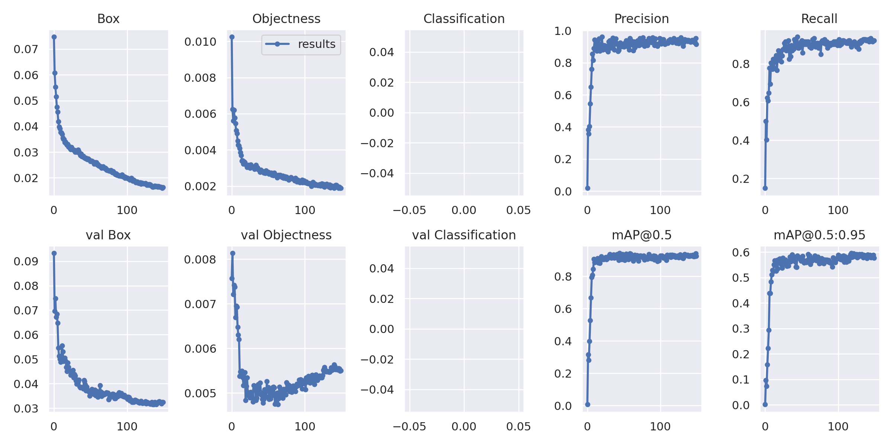

and there are some samples for detecting cars' plates:

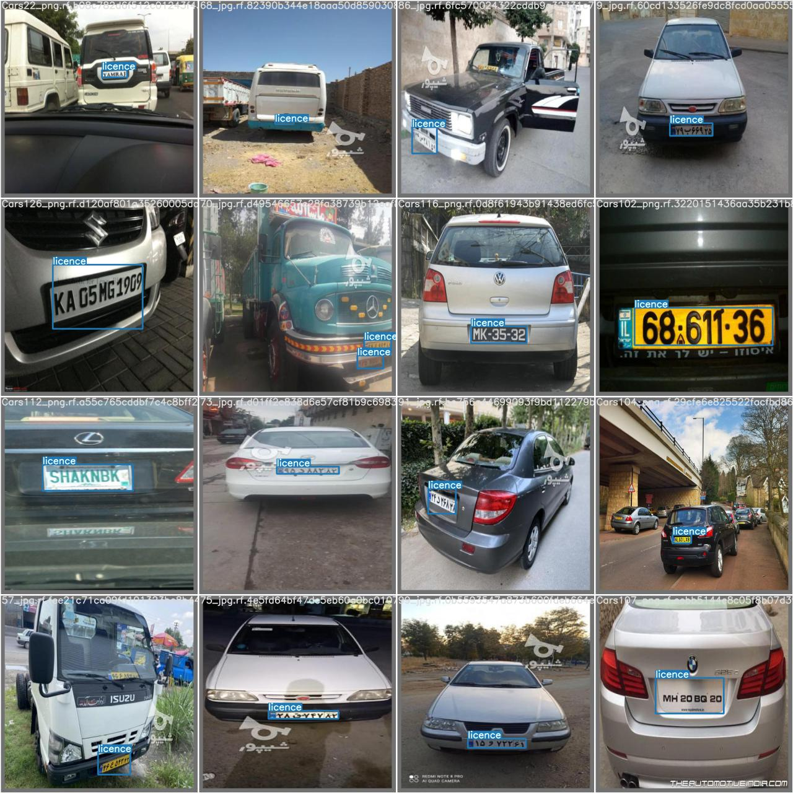

## Persian OCR
For training a model for Persian OCR, I used the following architecture:

```
model = Sequential()
model.add(Conv2D(filters = 16, kernel_size=(7,7), activation='relu', input_shape = (input_img_size,input_img_size,1), kernel_initializer='he_normal'))

model.add(Conv2D(filters = 12, kernel_size=(7,7), activation='relu', kernel_initializer='he_normal'))
model.add(Dropout(0.3))
model.add(Conv2D(filters = 8, kernel_size=(5,5), activation='relu', kernel_initializer='he_normal'))
model.add(Dropout(0.3))

model.add(Conv2D(filters = 8, kernel_size=(3,3), activation='relu', kernel_initializer='he_normal'))
model.add(Dropout(0.3))
model.add(MaxPool2D(pool_size=(2,2)))

model.add(Flatten())
model.add(Dense(512, activation='relu', kernel_initializer='he_normal'))
model.add(Dropout(0.3))
model.add(Dense(128, activation='relu', kernel_initializer='he_normal'))
model.add(Dropout(0.3))
model.add(Dense(64, activation='relu', kernel_initializer='he_normal'))
model.add(Dense(num_classes = 42, activation = 'softmax'))
```

The reason for using ```kernel_size=(7,7)``` and ```kernel_size=(5,5)``` is to increasing receptive field.
I used ```Dropout``` to avoid over fitting. Also using ```Learning Rate Scheduler``` was pretty useful. I started with ```lr = 4e-4``` and then after epoch 10, I decreased the Learning Rate.

here is the summary of the model:

```
_________________________________________________________________
 Layer (type)                Output Shape              Param #   
=================================================================
 conv2d_85 (Conv2D)          (None, 34, 34, 16)        800       
                                                                 
 conv2d_86 (Conv2D)          (None, 28, 28, 12)        9420      
                                                                 
 dropout_115 (Dropout)       (None, 28, 28, 12)        0         
                                                                 
 conv2d_87 (Conv2D)          (None, 24, 24, 8)         2408      
                                                                 
 dropout_116 (Dropout)       (None, 24, 24, 8)         0         
                                                                 
 conv2d_88 (Conv2D)          (None, 22, 22, 8)         584       
                                                                 
 dropout_117 (Dropout)       (None, 22, 22, 8)         0         
                                                                 
 max_pooling2d_22 (MaxPoolin  (None, 11, 11, 8)        0         
 g2D)                                                            
                                                                 
 flatten_23 (Flatten)        (None, 968)               0         
                                                                 
 dense_90 (Dense)            (None, 512)               496128    
                                                                 
 dropout_118 (Dropout)       (None, 512)               0         
                                                                 
 dense_91 (Dense)            (None, 128)               65664     
                                                                 
 dropout_119 (Dropout)       (None, 128)               0         
                                                                 
 dense_92 (Dense)            (None, 64)                8256      
                                                                 
 dense_93 (Dense)            (None, 42)                2730      
                                                                 
=================================================================
Total params: 585,990
Trainable params: 585,990
Non-trainable params: 0
_________________________________________________________________
```

the results of training are as below: 

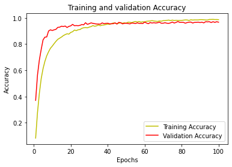

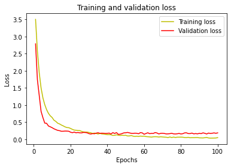

By looking at the above charts, it seems there has been no over fitting.

And here is the validation data's heatmap of the:

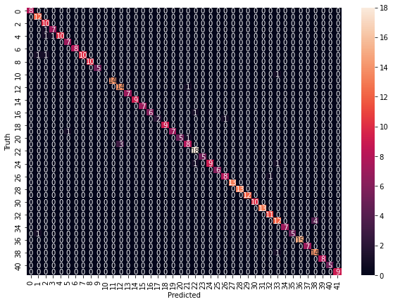

You can use the ```OCR_CNN_Persain``` file to continue the training.

## Applying OCR on Yolo
after extracting the plate of the car, I did some preprocessing such as removing unnecessary parts and applying Gaussian blur filter, I cropped each number and letter of the plate, here is an example:

this is a sample input image:

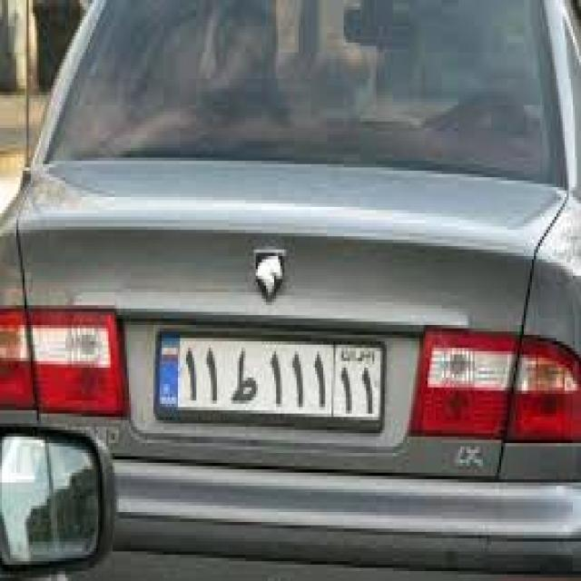

First, I cropped each number and letter of the image: 

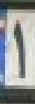
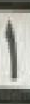
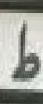
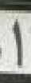
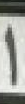
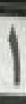
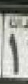
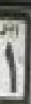

Now we can give the pictures as input to our OCR model and this is the final result:

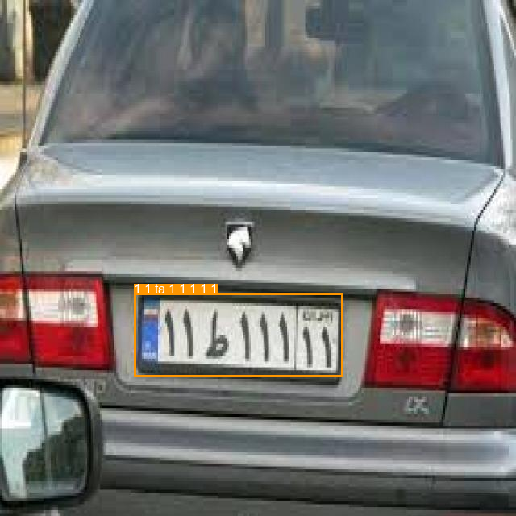
